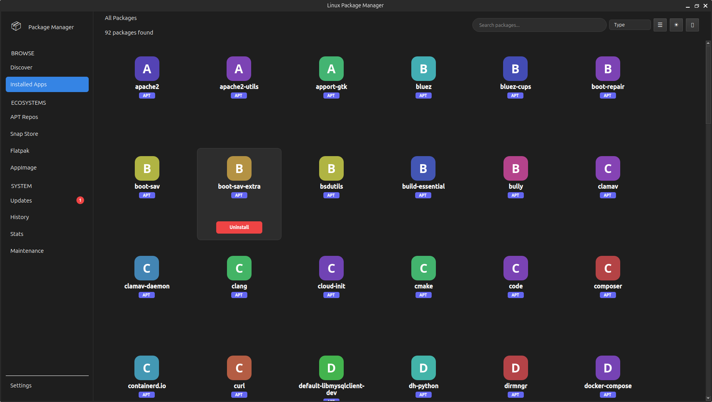
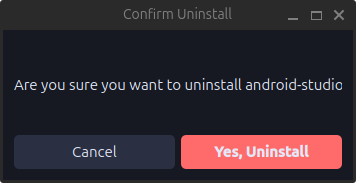

# 🐧 LinuxPkgManager

<div align="center">


**A modern GUI to manage your manually installed Linux packages — APT & Snap.**

**Une interface moderne pour gérer vos paquets Linux installés manuellement — APT & Snap.**

</div>

---

## 📸 Screenshots

<div align="center">

> *Screenshot — Main window / Fenêtre principale*
> 
> 

> *Screenshot — Uninstall confirmation / Confirmation de désinstallation*
>
> 

</div>

---

## 🇬🇧 English

### What is LinuxPkgManager?

LinuxPkgManager is a desktop application for Linux that displays **only the packages you manually installed** — filtering out system packages, libraries, and Ubuntu base components that clutter standard package managers.

Built with **PyQt6**, it runs natively on Linux with a dark, professional UI and smooth animations.

### ✨ Features

- Displays only manually installed packages (APT + Snap)
- Smart filtering: hides system packages, `lib*`, `gnome-*`, `ubuntu-*`, etc.
- Package icons fetched from system icon themes with fallback avatar
- One-click uninstall with confirmation dialog
- Live search with 150ms debounce
- Tabs: All / APT / Snap with live counters
- Toast notifications (success / error)
- Skeleton loading while fetching packages
- Non-blocking async backend (QThread)
- Lightweight: ~80MB RAM at idle

### 🖥️ Requirements

- Linux (Ubuntu 20.04+ recommended)
- Python 3.10+
- PyQt6
- `apt` and/or `snap` available on the system
- `pkexec` for uninstall privilege escalation

### 🚀 Installation

**Option 1 — Run from source**

```bash
git clone https://github.com/YOUR_USERNAME/LinuxPkgManager.git
cd LinuxPkgManager
python3 -m venv venv
source venv/bin/activate
pip install PyQt6
python main.py
```

**Option 2 — AppImage (standalone, no dependencies)**

```bash
# Download the latest release
chmod +x LinuxPkgManager-1.0.0-x86_64.AppImage
./LinuxPkgManager-1.0.0-x86_64.AppImage
```

### 🔨 Build AppImage from source

```bash
chmod +x build.sh
./build.sh
```

This will generate `LinuxPkgManager-1.0.0-x86_64.AppImage` in the project root.

### 📁 Project Structure

```
LinuxPkgManager/
├── main.py                  # Entry point
├── build.sh                 # AppImage build script
├── pkgmanager.spec          # PyInstaller spec
├── requirements.txt
├── ui/
│   ├── main_window.py       # Main window + Toast
│   ├── package_card.py      # Card + Skeleton components
│   └── styles.qss           # Dark theme stylesheet
├── core/
│   ├── apt_backend.py       # APT backend + smart filter
│   └── snap_backend.py      # Snap backend
└── assets/
    └── fallback_icon.svg
```

### 📄 License

MIT License — free to use, modify and distribute.

---

## 🇫🇷 Français

### Qu'est-ce que LinuxPkgManager ?

LinuxPkgManager est une application de bureau Linux qui affiche **uniquement les paquets que vous avez installés manuellement** — en filtrant les paquets système, bibliothèques et composants de base Ubuntu qui encombrent les gestionnaires de paquets classiques.

Développé avec **PyQt6**, il tourne nativement sur Linux avec une interface sombre et professionnelle.

### ✨ Fonctionnalités

- Affiche uniquement les paquets installés manuellement (APT + Snap)
- Filtrage intelligent : masque les paquets système, `lib*`, `gnome-*`, `ubuntu-*`, etc.
- Icônes des paquets récupérées depuis les thèmes système avec avatar de secours
- Désinstallation en un clic avec confirmation
- Recherche en temps réel avec debounce de 150ms
- Onglets : Tous / APT / Snap avec compteurs dynamiques
- Notifications toast (succès / erreur)
- Animation de chargement skeleton
- Backend asynchrone non-bloquant (QThread)
- Léger : ~80Mo RAM au repos

### 🖥️ Prérequis

- Linux (Ubuntu 20.04+ recommandé)
- Python 3.10+
- PyQt6
- `apt` et/ou `snap` disponibles sur le système
- `pkexec` pour l'élévation de privilèges lors de la désinstallation

### 🚀 Installation

**Option 1 — Lancer depuis les sources**

```bash
git clone https://github.com/YOUR_USERNAME/LinuxPkgManager.git
cd LinuxPkgManager
python3 -m venv venv
source venv/bin/activate
pip install PyQt6
python main.py
```

**Option 2 — AppImage (standalone, aucune dépendance)**

```bash
# Télécharger la dernière release
chmod +x LinuxPkgManager-1.0.0-x86_64.AppImage
./LinuxPkgManager-1.0.0-x86_64.AppImage
```

### 🔨 Compiler l'AppImage depuis les sources

```bash
chmod +x build.sh
./build.sh
```

Cela génère `LinuxPkgManager-1.0.0-x86_64.AppImage` à la racine du projet.

### 📁 Structure du projet

```
LinuxPkgManager/
├── main.py                  # Point d'entrée
├── build.sh                 # Script de build AppImage
├── pkgmanager.spec          # Spec PyInstaller
├── requirements.txt
├── ui/
│   ├── main_window.py       # Fenêtre principale + Toast
│   ├── package_card.py      # Composants Card + Skeleton
│   └── styles.qss           # Feuille de style thème sombre
├── core/
│   ├── apt_backend.py       # Backend APT + filtre intelligent
│   └── snap_backend.py      # Backend Snap
└── assets/
    └── fallback_icon.svg
```

### 📄 Licence

Licence MIT — libre d'utilisation, modification et distribution.

---

<div align="center">
Made with ❤️ for Linux users
</div>
