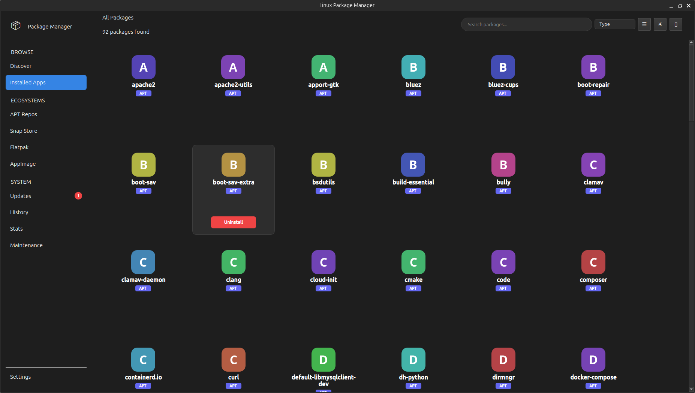
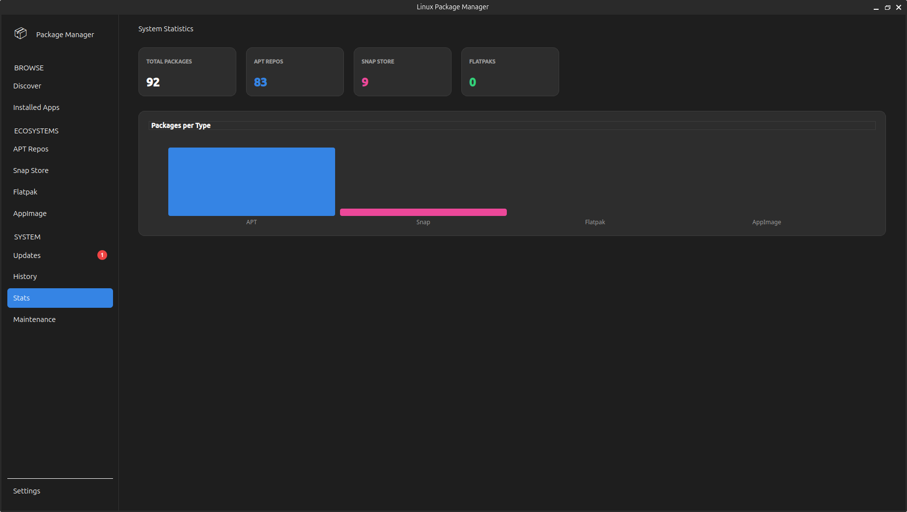
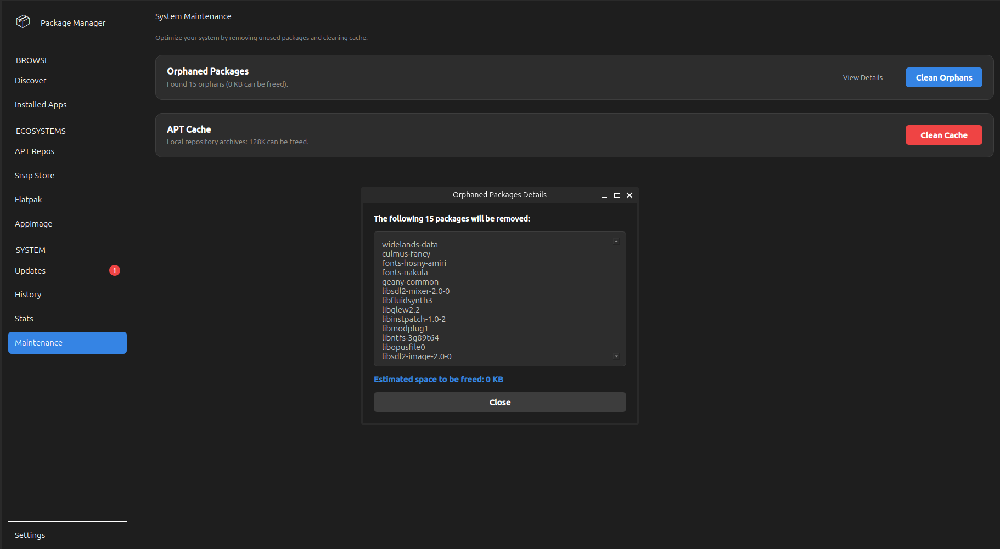
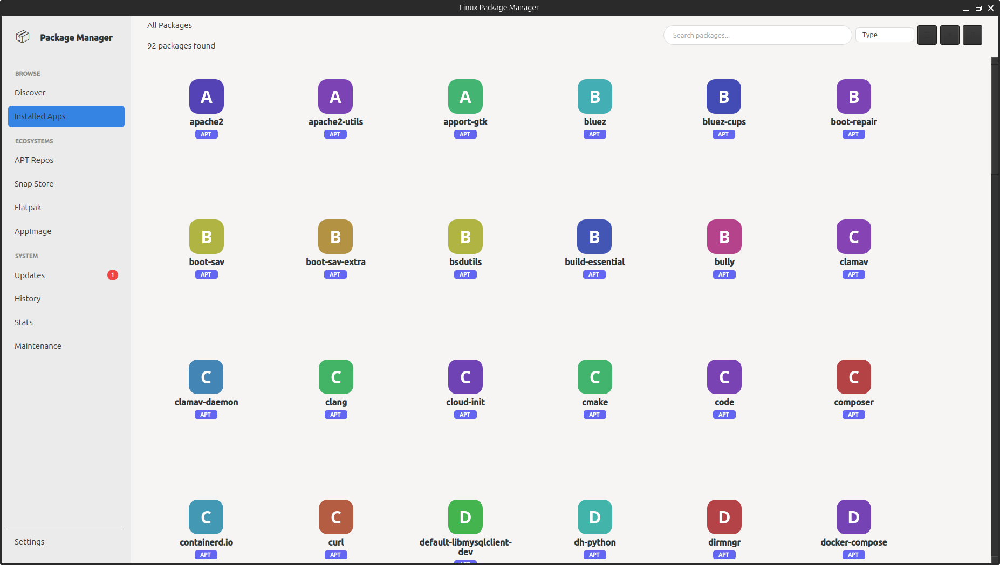

# 🐧 LinuxPkgManager

<div align="center">


**A modern GUI to manage your manually installed Linux packages — APT, Snap, Flatpak & more.**

**Une interface moderne pour gérer vos paquets Linux installés manuellement — APT, Snap, Flatpak & plus.**

</div>

---

## 📸 Screenshots

<div align="center">

> *Screenshot — Main window / Fenêtre principale*
>
> 

> *Screenshot — Statistics dashboard / Tableau de bord statistiques*
>
> 

> *Screenshot — Maintenance & cleanup / Maintenance et nettoyage*
>
> 

> *Screenshot — Light theme / Thème clair*
>
> 

</div>

---

## 🇬🇧 English

### What is LinuxPkgManager?

LinuxPkgManager is a desktop application for Linux that displays **only the packages you manually installed** — filtering out system packages, libraries, and Ubuntu base components that clutter standard package managers.

Built with **PyQt6**, it runs natively on Linux with a dark, professional UI, sidebar navigation and a rich set of package management tools.

### ✨ Features

#### Package Management
- Displays only manually installed packages (APT + Snap + Flatpak)
- Smart filtering: hides system packages, `lib*`, `gnome-*`, `ubuntu-*`, etc.
- Package icons fetched from system icon themes with fallback avatar
- One-click uninstall with confirmation dialog
- **Install packages** directly from APT repos and Snap store
- **Drag & drop `.deb` files** to inspect and install them
- **AppImage support** — detect AppImages in `~/Applications`, `~/Downloads`, `~/Desktop`

#### Updates & History
- **Package updates** — see all available updates with one-click "Update All"
- **Installation history** — full timeline from `dpkg.log` and `snap changes`
- Filter history by date, action (install/remove/upgrade) and package name

#### Maintenance
- **Orphan packages detection** — find unused dependencies with recoverable space
- **APT cache cleanup** — free disk space with one click
- **PPA management** — list, enable/disable and remove PPAs

#### UI & Experience
- **Light / Dark theme toggle** with saved preference
- **List / Grid view toggle** for package display
- **Advanced sorting** — by name, size, install date or type
- Sidebar navigation with section badges
- Live search with 150ms debounce
- Toast notifications (success / error)
- Skeleton loading animation
- **Statistics dashboard** — disk usage charts, package categories, install timeline
- Non-blocking async backend (QThread)
- Lightweight: ~120MB RAM with all features active

### 🖥️ Requirements

- Linux (Ubuntu 20.04, 22.04, 24.04 recommended)
- Python 3.10+
- PyQt6
- `apt` and/or `snap` available on the system
- `pkexec` for privilege escalation
- `flatpak` (optional — for Flatpak support)

### 🚀 Installation

**Option 1 — .deb package (recommended)**

```bash
wget https://github.com/kryss24/LinuxPkgManager/releases/download/v2.0.0/linuxpkgmanager_2.0.0_amd64.deb
sudo dpkg -i linuxpkgmanager_2.0.0_amd64.deb
sudo apt-get install -f
```

**Option 2 — Run from source**

```bash
git clone https://github.com/kryss24/LinuxPkgManager.git
cd LinuxPkgManager
python3 -m venv venv
source venv/bin/activate
pip install PyQt6
python main.py
```

### 📁 Project Structure

```
LinuxPkgManager/
├── main.py
├── requirements.txt
├── CHANGELOG.md
├── ui/
│   ├── main_window.py
│   ├── package_card.py
│   ├── styles.qss
│   ├── styles_light.qss
│   └── components/
│       ├── sidebar.py
│       ├── discover.py
│       ├── history.py
│       ├── maintenance.py
│       ├── ppa_manager.py
│       ├── stats.py
│       └── updates.py
├── core/
│   ├── apt_backend.py
│   ├── snap_backend.py
│   ├── flatpak_backend.py
│   ├── appimage_backend.py
│   ├── maintenance_worker.py
│   └── config.py
└── assets/
    └── icon.png
```

### 📄 License

MIT License — free to use, modify and distribute.

---

## 🇫🇷 Français

### Qu'est-ce que LinuxPkgManager ?

LinuxPkgManager est une application de bureau Linux qui affiche **uniquement les paquets que vous avez installés manuellement** — en filtrant les paquets système, bibliothèques et composants de base Ubuntu.

Développé avec **PyQt6**, il offre une interface sombre et professionnelle avec navigation par sidebar et un ensemble complet d'outils de gestion de paquets.

### ✨ Fonctionnalités

#### Gestion des paquets
- Affiche uniquement les paquets installés manuellement (APT + Snap + Flatpak)
- Filtrage intelligent : masque les paquets système, `lib*`, `gnome-*`, `ubuntu-*`, etc.
- Icônes des paquets récupérées depuis les thèmes système
- Désinstallation en un clic avec confirmation
- **Installation de paquets** directement depuis les dépôts APT et le Snap store
- **Glisser-déposer de fichiers `.deb`** pour les inspecter et installer
- **Support AppImage** — détection dans `~/Applications`, `~/Downloads`, `~/Desktop`

#### Mises à jour & Historique
- **Mises à jour des paquets** — voir toutes les updates avec "Tout mettre à jour"
- **Historique d'installation** — timeline complète depuis `dpkg.log` et `snap changes`
- Filtres par date, action et nom de paquet

#### Maintenance
- **Détection des paquets orphelins** avec espace récupérable affiché
- **Nettoyage du cache APT** en un clic
- **Gestion des PPAs** — lister, activer/désactiver et supprimer

#### Interface & Expérience
- **Bascule thème clair / sombre** avec sauvegarde de préférence
- **Bascule vue liste / grille**
- **Tri avancé** — par nom, taille, date ou type
- Navigation par sidebar avec badges
- Recherche en temps réel (debounce 150ms)
- Notifications toast (succès / erreur)
- Animation skeleton au chargement
- **Tableau de bord statistiques** — graphiques disque, catégories, timeline
- Backend asynchrone non-bloquant (QThread)
- Léger : ~120Mo RAM toutes fonctionnalités actives

### 🖥️ Prérequis

- Linux (Ubuntu 20.04, 22.04, 24.04 recommandé)
- Python 3.10+
- PyQt6
- `apt` et/ou `snap` disponibles
- `pkexec` pour l'élévation de privilèges
- `flatpak` (optionnel)

### 🚀 Installation

**Option 1 — Paquet .deb (recommandé)**

```bash
wget https://github.com/kryss24/LinuxPkgManager/releases/download/v2.0.0/linuxpkgmanager_2.0.0_amd64.deb
sudo dpkg -i linuxpkgmanager_2.0.0_amd64.deb
sudo apt-get install -f
```

**Option 2 — Depuis les sources**

```bash
git clone https://github.com/kryss24/LinuxPkgManager.git
cd LinuxPkgManager
python3 -m venv venv
source venv/bin/activate
pip install PyQt6
python main.py
```

### 📄 Licence

Licence MIT — libre d'utilisation, modification et distribution.

---

<div align="center">
Made with ❤️ for Linux users — v2.0.0
</div>
